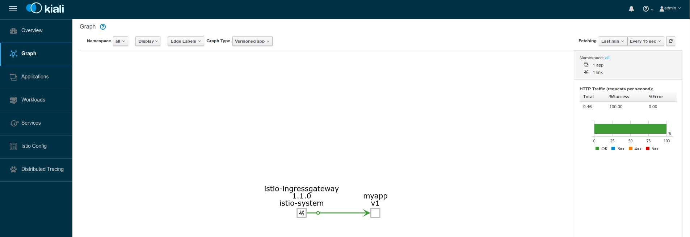
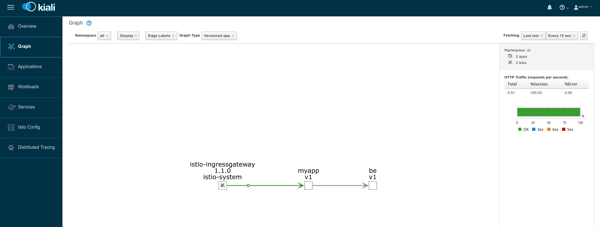
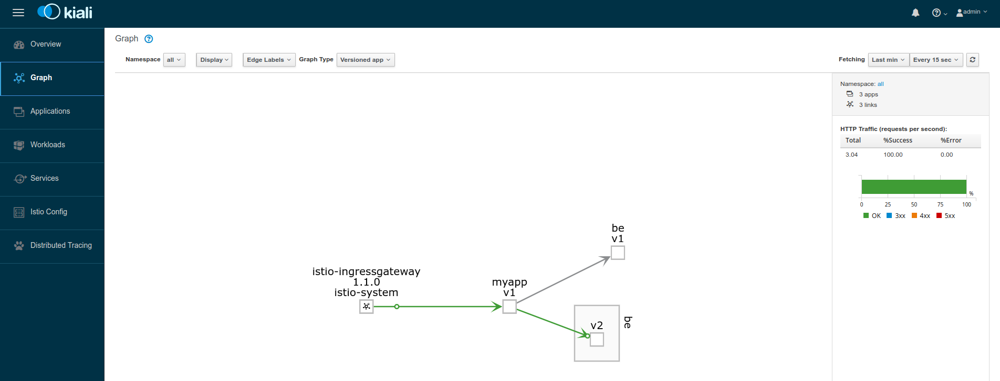
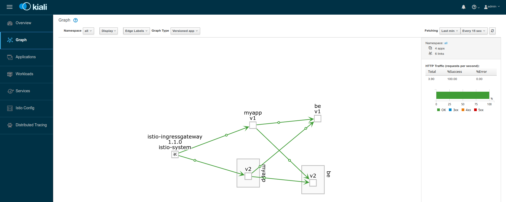
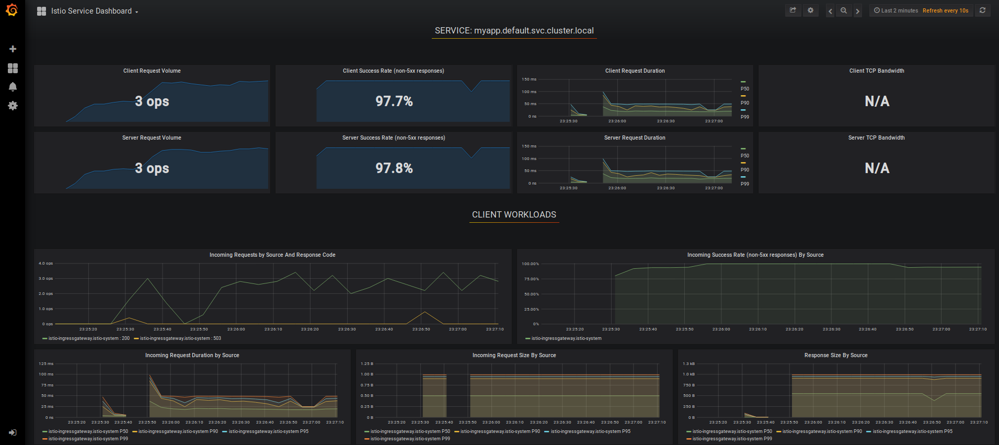
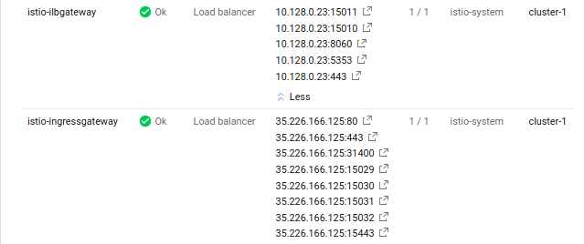

# Istio "Hello World" my way

## What is this repo?

This is a really simple application I wrote over holidays a couple weeks back that detail my experiences and
feedback.  To be clear, its a really, really basic NodeJS application that i used but more importantly, it covers
the main sections of [Istio](https://istio.io/) that i was seeking to understand better (if even just as a helloworld).  

I do know isito has the "[bookinfo](https://github.com/istio/istio/tree/master/samples/bookinfo)" application but the best way
i understand something is to rewrite sections and only those sections from the ground up.

## Istio version used

* 11/15/18:  Istio 1.1 Prelimanary build `release-1.1-20181115-09-15`
* [Prior Istio Versions](https://github.com/salrashid123/istio_helloworld/tags)


## What i tested

- Basic istio Installation on Google Kubernetes Engine.
- Grafana
- Prometheus
- Kiali and SourceGraph
- Jaeger
- Route Control
- Destination Rules
- Egress Policies
- LUA HttpFilter
- Authorization
- Internal LoadBalancer (GCP)


## What is the app you used?

NodeJS in a Dockerfile...something really minimal.  You can find the entire source under the 'nodeapp' folder in this repo.

The endpoints on this app are as such:

- ```/```:  Does nothing;  ([source](https://github.com/salrashid123/istio_helloworld/blob/master/nodeapp/app.js#L24))
- ```/varz```:  Returns all the environment variables on the current Pod ([source](https://github.com/salrashid123/istio_helloworld/blob/master/nodeapp/app.js#L33))
- ```/version```: Returns just the "process.env.VER" variable that was set on the Deployment ([source](https://github.com/salrashid123/istio_helloworld/blob/master/nodeapp/app.js#L37))
- ```/backend```: Return the nodename, pod name.  Designed to only get called as if the applciation running is a 'backend' ([source](https://github.com/salrashid123/istio_helloworld/blob/master/nodeapp/app.js#L41))
- ```/hostz```:  Does a DNS SRV lookup for the 'backend' and makes an http call to its '/backend', endpoint ([source](https://github.com/salrashid123/istio_helloworld/blob/master/nodeapp/app.js#L45))
- ```/requestz```:  Makes an HTTP fetch for three external URLs (used to show egress rules) ([source](https://github.com/salrashid123/istio_helloworld/blob/master/nodeapp/app.js#L95))
- ```/headerz```:  Displays inbound headers
 ([source](https://github.com/salrashid123/istio_helloworld/blob/master/nodeapp/app.js#L115))

I build and uploaded this app to dockerhub at

```
docker.io/salrashid123/istioinit:1
docker.io/salrashid123/istioinit:2
```
(to simulat two release version of an app ...yeah, theyr'e the same app but during deployment i set an env-var directly):


You're also free to build and push these images directly:
```
docker build  --build-arg VER=1 -t your_dockerhub_id/istioinit:1 .
docker build  --build-arg VER=2 -t your_dockerhub_id/istioinit:2 .

docker push your_dockerhub_id/istioinit:1
docker push your_dockerhub_id/istioinit:2
```

To give you a sense of the differences between a regular GKE specification yaml vs. one modified for istio, you can compare:
- [all-istio.yaml](all-istio.yaml)  vs [all-gke.yaml](all-gke.yaml)
(review Ingress config, etc)

## Lets get started

### Create a 1.10+ GKE Cluster and Bootstrap Istio


```bash

gcloud container  clusters create cluster-1 --machine-type "n1-standard-2" --zone us-central1-a  --num-nodes 4

gcloud container clusters get-credentials cluster-1 --zone us-central1-a

kubectl create clusterrolebinding cluster-admin-binding --clusterrole=cluster-admin --user=$(gcloud config get-value core/account)

kubectl create ns istio-system

#export ISTIO_VERSION=1.1
#wget https://github.com/istio/istio/releases/download/$ISTIO_VERSION/istio-$ISTIO_VERSION-linux.tar.gz
#tar xvzf istio-$ISTIO_VERSION-linux.tar.gz

export ISTIO_VERSION=release-1.1-20181115-09-15
wget https://storage.googleapis.com/istio-prerelease/daily-build/$ISTIO_VERSION/istio-$ISTIO_VERSION-linux.tar.gz
tar xf istio-$ISTIO_VERSION-linux.tar.gz

wget https://storage.googleapis.com/kubernetes-helm/helm-v2.11.0-linux-amd64.tar.gz
tar xf helm-v2.11.0-linux-amd64.tar.gz

export PATH=`pwd`/istio-$ISTIO_VERSION/bin:`pwd`/linux-amd64/:$PATH

kubectl apply -f istio-$ISTIO_VERSION/install/kubernetes/helm/istio/templates/crds.yaml
kubectl apply -f istio-$ISTIO_VERSION/install/kubernetes/helm/subcharts/certmanager/templates/crds.yaml

sleep 15

helm init --client-only
#helm repo add istio.io https://storage.googleapis.com/istio-release/releases/1.1.0/charts/
helm repo add istio.io https://storage.googleapis.com/istio-prerelease/daily-build/release-1.1-latest-daily/charts
helm dependency update istio-$ISTIO_VERSION/install/kubernetes/helm/istio

# https://github.com/istio/istio/tree/master/install/kubernetes/helm/istio#configuration
# https://istio.io/docs/reference/config/installation-options/

helm template istio-$ISTIO_VERSION/install/kubernetes/helm/istio --name istio --namespace istio-system \
   --set prometheus.enabled=true \
   --set servicegraph.enabled=true \
   --set grafana.enabled=true \
   --set tracing.enabled=true \
   --set sidecarInjectorWebhook.enabled=true \
   --set gateways.istio-ilbgateway.enabled=true \
   --set global.mtls.enabled=true  > istio.yaml

kubectl apply -f istio.yaml
kubectl apply -f istio-ilbgateway-service.yaml

kubectl label namespace default istio-injection=enabled


export USERNAME=$(echo -n 'admin' | base64)
export PASSPHRASE=$(echo -n 'mysecret' | base64)
export NAMESPACE=istio-system

echo '
apiVersion: v1
kind: Secret
metadata:
  name: kiali
  namespace: $NAMESPACE
  labels:
    app: kiali
type: Opaque
data:
  username: $USERNAME
  passphrase: $PASSPHRASE           
' | envsubst > kiali_secret.yaml

kubectl apply -f kiali_secret.yaml

export KIALI_OPTIONS=" --set kiali.enabled=true "
KIALI_OPTIONS=$KIALI_OPTIONS"  --set kiali.dashboard.grafanaURL=http://localhost:3000"
KIALI_OPTIONS=$KIALI_OPTIONS" --set kiali.dashboard.jaegerURL=http://localhost:16686"
helm template istio-$ISTIO_VERSION/install/kubernetes/helm/istio --name istio --namespace istio-system $KIALI_OPTIONS  > istio_kiali.yaml

kubectl apply -f istio_kiali.yaml
```

Wait maybe 2 to 3 minutes and make sure all the Deployments are live:

- For reference, here are the Istio [installation options](https://istio.io/docs/reference/config/installation-options/)

### Make sure the Istio installation is ready

Verify this step by makeing sure all the ```Deployments``` are Available.

```bash
$ kubectl get no,po,rc,svc,ing,deployment -n istio-system
NAME                                            STATUS    ROLES     AGE       VERSION
node/gke-cluster-1-default-pool-501892d1-0dk7   Ready     <none>    1h        v1.10.9-gke.5
node/gke-cluster-1-default-pool-501892d1-43xv   Ready     <none>    1h        v1.10.9-gke.5
node/gke-cluster-1-default-pool-501892d1-mpbg   Ready     <none>    1h        v1.10.9-gke.5
node/gke-cluster-1-default-pool-501892d1-xrb2   Ready     <none>    1h        v1.10.9-gke.5

NAME                                           READY     STATUS      RESTARTS   AGE
pod/grafana-98d47d7c7-6kzrg                    1/1       Running     0          1h
pod/istio-citadel-7b684cb9f9-thxhl             1/1       Running     0          1h
pod/istio-cleanup-secrets-v1.1.0-x7wjt         0/1       Completed   0          1h
pod/istio-egressgateway-6f65d46d56-dh9dd       1/1       Running     0          1h
pod/istio-galley-77fbf68578-gf85d              1/1       Running     0          1h
pod/istio-grafana-post-install-v1.1.0-tknsd    0/1       Completed   0          1h
pod/istio-ilbgateway-dc84bbd5-9w4xx            1/1       Running     0          1h
pod/istio-ingressgateway-79cbb44f59-kmj9g      1/1       Running     0          1h
pod/istio-pilot-749dd6dd97-qlt9t               2/2       Running     0          1h
pod/istio-policy-5cdd845445-4fhwm              2/2       Running     0          1h
pod/istio-security-post-install-v1.1.0-4jlm4   0/1       Completed   0          1h
pod/istio-sidecar-injector-6449d5b555-54gwg    1/1       Running     0          1h
pod/istio-telemetry-5b8fd8ccb9-vncvm           2/2       Running     0          1h
pod/istio-tracing-7fbf78f9f4-nbmvl             1/1       Running     0          1h
pod/kiali-5cff99b77d-2rtcz                     1/1       Running     0          1h
pod/prometheus-7fcd5846db-mvck8                1/1       Running     0          1h
pod/servicegraph-dcd5d6848-v7krs               1/1       Running     0          1h

NAME                             TYPE           CLUSTER-IP      EXTERNAL-IP      PORT(S)                                                                                                                      AGE
service/grafana                  ClusterIP      10.15.243.12    <none>           3000/TCP                                                                                                                     1h
service/istio-citadel            ClusterIP      10.15.246.33    <none>           8060/TCP,9093/TCP                                                                                                            1h
service/istio-egressgateway      ClusterIP      10.15.254.221   <none>           80/TCP,443/TCP,15443/TCP                                                                                                     1h
service/istio-galley             ClusterIP      10.15.242.37    <none>           443/TCP,9093/TCP,9901/TCP                                                                                                    1h
service/istio-ilbgateway         LoadBalancer   10.15.245.78    10.128.0.23      15011:30423/TCP,15010:31705/TCP,8060:32256/TCP,5353:32522/TCP,443:30089/TCP                                                  1h
service/istio-ingressgateway     LoadBalancer   10.15.250.79    35.226.166.125   80:31380/TCP,443:31390/TCP,31400:31400/TCP,15029:31415/TCP,15030:30633/TCP,15031:31407/TCP,15032:30076/TCP,15443:31664/TCP   1h
service/istio-pilot              ClusterIP      10.15.245.206   <none>           15010/TCP,15011/TCP,8080/TCP,9093/TCP                                                                                        1h
service/istio-policy             ClusterIP      10.15.249.140   <none>           9091/TCP,15004/TCP,9093/TCP                                                                                                  1h
service/istio-sidecar-injector   ClusterIP      10.15.241.210   <none>           443/TCP                                                                                                                      1h
service/istio-telemetry          ClusterIP      10.15.243.201   <none>           9091/TCP,15004/TCP,9093/TCP,42422/TCP                                                                                        1h
service/jaeger-agent             ClusterIP      None            <none>           5775/UDP,6831/UDP,6832/UDP                                                                                                   1h
service/jaeger-collector         ClusterIP      10.15.243.254   <none>           14267/TCP,14268/TCP                                                                                                          1h
service/jaeger-query             ClusterIP      10.15.249.19    <none>           16686/TCP                                                                                                                    1h
service/kiali                    ClusterIP      10.15.254.225   <none>           20001/TCP                                                                                                                    1h
service/prometheus               ClusterIP      10.15.248.219   <none>           9090/TCP                                                                                                                     1h
service/servicegraph             ClusterIP      10.15.244.77    <none>           8088/TCP                                                                                                                     1h
service/tracing                  ClusterIP      10.15.246.41    <none>           80/TCP                                                                                                                       1h
service/zipkin                   ClusterIP      10.15.241.96    <none>           9411/TCP                                                                                                                     1h

NAME                                           DESIRED   CURRENT   UP-TO-DATE   AVAILABLE   AGE
deployment.extensions/grafana                  1         1         1            1           1h
deployment.extensions/istio-citadel            1         1         1            1           1h
deployment.extensions/istio-egressgateway      1         1         1            1           1h
deployment.extensions/istio-galley             1         1         1            1           1h
deployment.extensions/istio-ilbgateway         1         1         1            1           1h
deployment.extensions/istio-ingressgateway     1         1         1            1           1h
deployment.extensions/istio-pilot              1         1         1            1           1h
deployment.extensions/istio-policy             1         1         1            1           1h
deployment.extensions/istio-sidecar-injector   1         1         1            1           1h
deployment.extensions/istio-telemetry          1         1         1            1           1h
deployment.extensions/istio-tracing            1         1         1            1           1h
deployment.extensions/kiali                    1         1         1            1           1h
deployment.extensions/prometheus               1         1         1            1           1h
deployment.extensions/servicegraph             1         1         1            1           1h

```


### Make sure the Istio an IP for the ```LoadBalancer``` is assigned:

Run

```
kubectl get svc istio-ingressgateway -n istio-system

export GATEWAY_IP=$(kubectl -n istio-system get service istio-ingressgateway -o jsonpath='{.status.loadBalancer.ingress[0].ip}')
echo $GATEWAY_IP
```


### Setup some tunnels to each of the services:

Open up three new shell windows and type in one line into each:
```
kubectl -n istio-system port-forward $(kubectl -n istio-system get pod -l app=grafana -o jsonpath='{.items[0].metadata.name}') 3000:3000

kubectl -n istio-system port-forward $(kubectl -n istio-system get pod -l app=servicegraph -o jsonpath='{.items[0].metadata.name}') 8088:8088

kubectl port-forward -n istio-system $(kubectl get pod -n istio-system -l app=jaeger -o jsonpath='{.items[0].metadata.name}') 16686:16686

kubectl -n istio-system port-forward $(kubectl -n istio-system get pod -l app=kiali -o jsonpath='{.items[0].metadata.name}') 20001:20001
```

Open up a browser (three tabs) and go to:
- Kiali http://localhost:20001/kiali (username: admin, password: mysecret)
- ServiceGraph http://localhost:8088/dotviz
- Grafana http://localhost:3000/dashboard/db/istio-dashboard
- Jaeger http://localhost:16686


### Deploy the sample application

The default ```all-istio.yaml``` runs:

- Ingress with SSL
- Deployments:
- - myapp-v1:  1 replica
- - myapp-v2:  1 replica
- - be-v1:  1 replicas
- - be-v2:  1 replicas

basically, a default frontend-backend scheme with two replicas each and the same 'v1' verison.

> Note: the default yaml pulls and run my dockerhub image- feel free to change this if you want.


```
kubectl apply -f all-istio.yaml
```

now use ```kubectl``` to create the ingress-gateway:


```
kubectl apply -f istio-ingress-gateway.yaml
kubectl apply -f istio-ingress-ilbgateway.yaml
```

and then initialize istio on a sample application

```
kubectl apply -f istio-fev1-bev1.yaml
```

Wait until the deployments complete:

```
$ kubectl get po,deployments,svc,ing
NAME                            READY     STATUS    RESTARTS   AGE
pod/be-v1-5bc4cc7f6b-sbts8      2/2       Running   0          4m
pod/be-v2-9dd4cf9b8-qw45b       2/2       Running   0          4m
pod/myapp-v1-5bcff7b6d6-q89mt   2/2       Running   0          4m
pod/myapp-v2-86556c7c8b-cwzbk   2/2       Running   0          4m

NAME                             DESIRED   CURRENT   UP-TO-DATE   AVAILABLE   AGE
deployment.extensions/be-v1      1         1         1            1           4m
deployment.extensions/be-v2      1         1         1            1           4m
deployment.extensions/myapp-v1   1         1         1            1           4m
deployment.extensions/myapp-v2   1         1         1            1           4m

NAME                 TYPE        CLUSTER-IP      EXTERNAL-IP   PORT(S)    AGE
service/be           ClusterIP   10.11.250.166   <none>        8080/TCP   4m
service/kubernetes   ClusterIP   10.11.240.1     <none>        443/TCP    29m
service/myapp        ClusterIP   10.11.255.238   <none>        8080/TCP   4m
```

Notice that each pod has two containers:  one is from isto, the other is the applicaiton itself (this is because we have automatic sidecar injection enabled).

Also note that in ```all-istio.yaml``` we did not define an ```Ingress``` object though we've defined a TLS secret with a very specific metadata name: ```istio-ingressgateway-certs```.  That is a special name for a secret that is used by Istio to setup its own ingress gateway:


#### Ingress Gateway Secret in 1.0.0+

Note the ```istio-ingress-gateway``` secret specifies the Ingress cert to use (the specific metadata name is special and is **required**)

```yaml
apiVersion: v1
data:
  tls.crt: _redacted_
  tls.key: _redacted_
kind: Secret
metadata:
  name: istio-ingressgateway-certs
  namespace: istio-system
type: kubernetes.io/tls
```

Remember we've acquired the ```$GATEWAY_IP``` earlier:

```
export GATEWAY_IP=$(kubectl -n istio-system get service istio-ingressgateway -o jsonpath='{.status.loadBalancer.ingress[0].ip}')
echo $GATEWAY_IP
```

### Send Traffic

This section shows basic user->frontend traffic and how serviceGrpah and Grafana consoles:

#### Frontend only

So...lets send traffic with the ip; (the ```/varz``` endpoint will send traffic to the frontend service only)

```bash
for i in {1..1000}; do curl -k  https://$GATEWAY_IP/version; sleep 1; done
```

You should see a sequence of 1's indicating the version of the frontend ```/version``` you just hit
```
111111111111111111111111111111111
```
(source: [/version](https://github.com/salrashid123/istio_helloworld/blob/master/nodeapp/app.js#L37) endpoint)

You should also see on servicegraph:



and


#### Frontend and Backend

Now the next step in th exercise:

to send requests to ```user-->frontend--> backend```;  we'll use the applications ```/hostz``` endpoint to do that.

(note i'm using  [jq](https://stedolan.github.io/jq/) utility to parse JSON)

```
for i in {1..1000}; do curl -s -k https://$GATEWAY_IP/hostz | jq '.[0].body'; done
```

you should see output indicating traffic from the v1 backend verison: ```be-v1-*```

```
$ for i in {1..1000}; do curl -s -k https://$GATEWAY_IP/hostz | jq '.[0].body'; done
"pod: [be-v1-5bc4cc7f6b-sbts8]    node: [gke-cluster-1-default-pool-a2fdcf98-6mrq]"
"pod: [be-v1-5bc4cc7f6b-sbts8]    node: [gke-cluster-1-default-pool-a2fdcf98-6mrq]"
"pod: [be-v1-5bc4cc7f6b-sbts8]    node: [gke-cluster-1-default-pool-a2fdcf98-6mrq]"
"pod: [be-v1-5bc4cc7f6b-sbts8]    node: [gke-cluster-1-default-pool-a2fdcf98-6mrq]"
"pod: [be-v1-5bc4cc7f6b-sbts8]    node: [gke-cluster-1-default-pool-a2fdcf98-6mrq]"
"pod: [be-v1-5bc4cc7f6b-sbts8]    node: [gke-cluster-1-default-pool-a2fdcf98-6mrq]"
"pod: [be-v1-5bc4cc7f6b-sbts8]    node: [gke-cluster-1-default-pool-a2fdcf98-6mrq]"
"pod: [be-v1-5bc4cc7f6b-sbts8]    node: [gke-cluster-1-default-pool-a2fdcf98-6mrq]"
"pod: [be-v1-5bc4cc7f6b-sbts8]    node: [gke-cluster-1-default-pool-a2fdcf98-6mrq]"
"pod: [be-v1-5bc4cc7f6b-sbts8]    node: [gke-cluster-1-default-pool-a2fdcf98-6mrq]"
"pod: [be-v1-5bc4cc7f6b-sbts8]    node: [gke-cluster-1-default-pool-a2fdcf98-6mrq]"
```

Note both ServiceGraph and Grafana shows both frontend and backend service telemetry and that traffic to ```be:v1``` is 0 req/s




## Route Control

This section details how to slectively send traffic to service ```versions```

### Selective Traffic

In this sequence,  we will setup a routecontrol to:

1. Send all traffic to ```myapp:v1```.  
2. traffic from ```myapp:v1``` to be can only go to ```be:v2```

The yaml on ```istio-fev1-bev2.yaml``` would direct inbound traffic for ```myapp:v1``` to go to ```be:v2``` (note the ```sourceLabels:``` part that specifies requests inbound from ```myapp:v1```).  The snippet for this config is:

```yaml
apiVersion: networking.istio.io/v1alpha3
kind: VirtualService
metadata:
  name: be-virtualservice
spec:
  gateways:
  - mesh
  hosts:
  - be
  http:
  - match:
    - sourceLabels:
        app: myapp
        version: v1
    route:
    - destination:
        host: be
        subset: v2
      weight: 100
---
apiVersion: networking.istio.io/v1alpha3
kind: DestinationRule
metadata:
  name: be-destination
spec:
  host: be
  trafficPolicy:
    tls:
      mode: ISTIO_MUTUAL
    loadBalancer:
      simple: ROUND_ROBIN
  subsets:
  - name: v1
    labels:
      version: v1
  - name: v2
    labels:
      version: v2
```

Then setup the config with kubectl:

```
kubectl replace -f istio-fev1-bev2.yaml
```

After sending traffic to check which backend system was called ```/hostz```, we see responses from only ```be-v2-*```.
What the ```/hosts``` endpoint does is takes a users request to ```fe-*``` and targets any ```be-*```.  Since we only have ```fe-v1``` instances
running, the traffic outbound for ```be-*``` must terminate at a ```be-v2``` version given the rule above:

```
$ for i in {1..1000}; do curl -s -k https://$GATEWAY_IP/hostz | jq '.[0].body'; done
"pod: [be-v2-9dd4cf9b8-qw45b]    node: [gke-cluster-1-default-pool-a2fdcf98-97hc]"
"pod: [be-v2-9dd4cf9b8-qw45b]    node: [gke-cluster-1-default-pool-a2fdcf98-97hc]"
"pod: [be-v2-9dd4cf9b8-qw45b]    node: [gke-cluster-1-default-pool-a2fdcf98-97hc]"
"pod: [be-v2-9dd4cf9b8-qw45b]    node: [gke-cluster-1-default-pool-a2fdcf98-97hc]"
"pod: [be-v2-9dd4cf9b8-qw45b]    node: [gke-cluster-1-default-pool-a2fdcf98-97hc]"
"pod: [be-v2-9dd4cf9b8-qw45b]    node: [gke-cluster-1-default-pool-a2fdcf98-97hc]"
"pod: [be-v2-9dd4cf9b8-qw45b]    node: [gke-cluster-1-default-pool-a2fdcf98-97hc]"
"pod: [be-v2-9dd4cf9b8-qw45b]    node: [gke-cluster-1-default-pool-a2fdcf98-97hc]"
"pod: [be-v2-9dd4cf9b8-qw45b]    node: [gke-cluster-1-default-pool-a2fdcf98-97hc]"
```

and on the frontend version is always one.
```
for i in {1..100}; do curl -k https://$GATEWAY_IP/version; sleep 1; done
11111111111111111111111111111
```

Note the traffic to ```be-v1``` is 0 while there is a non-zero traffic to ```be-v2``` from ```fe-v1```:




If we now overlay rules that direct traffic allow interleaved  ```fe(v1|v2) -> be(v1|v2)``` we expect to see requests to both frontend v1 and backend
```
kubectl replace -f istio-fev1v2-bev1v2.yaml
```

then frontend is both v1 and v2:
```
for i in {1..1000}; do curl -k  https://$GATEWAY_IP/version;  done
111211112122211121212211122211
```

and backend is responses comes from both be-v1 and be-v2

```
$ for i in {1..1000}; do curl -s -k https://$GATEWAY_IP/hostz | jq '.[0].body';  done

"pod: [be-v2-9dd4cf9b8-qw45b]    node: [gke-cluster-1-default-pool-a2fdcf98-97hc]"
"pod: [be-v2-9dd4cf9b8-qw45b]    node: [gke-cluster-1-default-pool-a2fdcf98-97hc]"
"pod: [be-v2-9dd4cf9b8-qw45b]    node: [gke-cluster-1-default-pool-a2fdcf98-97hc]"
"pod: [be-v1-5bc4cc7f6b-sbts8]   node: [gke-cluster-1-default-pool-a2fdcf98-6mrq]"
"pod: [be-v2-9dd4cf9b8-qw45b]    node: [gke-cluster-1-default-pool-a2fdcf98-97hc]"
"pod: [be-v1-5bc4cc7f6b-sbts8]   node: [gke-cluster-1-default-pool-a2fdcf98-6mrq]"
"pod: [be-v1-5bc4cc7f6b-sbts8]   node: [gke-cluster-1-default-pool-a2fdcf98-6mrq]"
"pod: [be-v2-9dd4cf9b8-qw45b]    node: [gke-cluster-1-default-pool-a2fdcf98-97hc]"
"pod: [be-v1-5bc4cc7f6b-sbts8]   node: [gke-cluster-1-default-pool-a2fdcf98-6mrq]"
"pod: [be-v2-9dd4cf9b8-qw45b]    node: [gke-cluster-1-default-pool-a2fdcf98-97hc]"
"pod: [be-v2-9dd4cf9b8-qw45b]    node: [gke-cluster-1-default-pool-a2fdcf98-97hc]"
"pod: [be-v2-9dd4cf9b8-qw45b]    node: [gke-cluster-1-default-pool-a2fdcf98-97hc]"
"pod: [be-v1-5bc4cc7f6b-sbts8]   node: [gke-cluster-1-default-pool-a2fdcf98-6mrq]"
"pod: [be-v1-5bc4cc7f6b-sbts8]   node: [gke-cluster-1-default-pool-a2fdcf98-6mrq]"

```






### Route Path

Now lets setup a more selective route based on a specific path in the URI:

- Route requests to myapp where path=/version to only ```v1```
  A request to ```http://gateway_ip/version``` will go to ```v1``` only


```yaml
---
apiVersion: networking.istio.io/v1alpha3
kind: VirtualService
metadata:
  name: myapp-virtualservice
spec:
  hosts:
  - "*"
  gateways:
  - my-gateway
  http:
  - match:
    - uri:
        exact: /version
    route:
    - destination:
        host: myapp
        subset: v1
  - route:
    - destination:
        host: myapp
        subset: v1
      weight: 20
    - destination:
        host: myapp
        subset: v2
      weight: 80
```


```
kubectl replace -f istio-route-version-fev1-bev1v2.yaml
```

```
for i in {1..1000}; do curl -k  https://$GATEWAY_IP/version; done
1111111111111111111
```

You may have noted how the route to the destination is weighted split vs delcared round robin (eg:)
```yaml
  - route:
    - destination:
        host: myapp
        subset: v1
      weight: 20
    - destination:
        host: myapp
        subset: v2
      weight: 80
```

Normally, you can use that destination rule to split traffic between services alltogether (eg, in real life you may have):
```yaml
  - route:
    - destination:
        host: app1
        subset: v1
      weight: 50
    - destination:
        host: app2
        subset: v10
      weight: 50
```

which for any other endpoint other than endpoint other thatn ```/version```, each request is split 50/50 between two destination services (```app1``` and ```app2```)


Anyway, now lets edit rule to  and change the prefix match to ```/xversion``` so the match doesn't apply
  A request to http://gateway_ip/version will go to v1 and v2 (since the path rule did not match)

Once you make this change, use ```kubectl``` to make the change happen

```
kubectl replace -f istio-route-version-fev1-bev1v2.yaml
```


```kubectl delete -f all-istio.yaml```

```
for i in {1..1000}; do curl -k  https://$GATEWAY_IP/version; sleep 1; done
2121212222222222222221122212211222222222222222
```

What you're seeing is ```myapp-v1``` now getting about 20% of the traffic while ```myapp-v2``` gets 80%

### Destination Rules

These rules sends all traffic from ```myapp-v1``` round-robin to both version of the backend.

First lets  force all gateway requests to go to ```v1``` only:

on ```istio-fev1-bev1v2.yaml```:


```yaml
apiVersion: networking.istio.io/v1alpha3
kind: VirtualService
metadata:
  name: myapp-virtualservice
spec:
  hosts:
  - "*"
  gateways:
  - my-gateway
  http:
  - route:
    - destination:
        host: myapp
        subset: v1
```


And where the backend trffic is split between ```be-v1``` and ```be-v2``` with a ```ROUND_ROBIN```

```yaml
apiVersion: networking.istio.io/v1alpha3
kind: DestinationRule
metadata:
  name: be-destination
spec:
  host: be
  trafficPolicy:
    tls:
      mode: ISTIO_MUTUAL
    loadBalancer:
      simple: ROUND_ROBIN
  subsets:
  - name: v1
    labels:
      version: v1
  - name: v2
    labels:
      version: v2
```

After you apply the rule,

```
kubectl replace -f istio-fev1-bev1v2.yaml
```

you'll see frontend request all going to ```fe-v1```

```
for i in {1..1000}; do curl -k  https://$GATEWAY_IP/version; sleep 1; done
11111111111111
```

with backend requests coming from pretty much round robin

```bash
$ for i in {1..1000}; do curl -s -k https://$GATEWAY_IP/hostz | jq '.[0].body'; sleep 1; done

"pod: [be-v2-9dd4cf9b8-qw45b]    node: [gke-cluster-1-default-pool-a2fdcf98-97hc]"
"pod: [be-v1-5bc4cc7f6b-sbts8]   node: [gke-cluster-1-default-pool-a2fdcf98-6mrq]"
"pod: [be-v1-5bc4cc7f6b-sbts8]   node: [gke-cluster-1-default-pool-a2fdcf98-6mrq]"
"pod: [be-v2-9dd4cf9b8-qw45b]    node: [gke-cluster-1-default-pool-a2fdcf98-97hc]"
"pod: [be-v1-5bc4cc7f6b-sbts8]   node: [gke-cluster-1-default-pool-a2fdcf98-6mrq]"
"pod: [be-v2-9dd4cf9b8-qw45b]    node: [gke-cluster-1-default-pool-a2fdcf98-97hc]"
"pod: [be-v1-5bc4cc7f6b-sbts8]   node: [gke-cluster-1-default-pool-a2fdcf98-6mrq]"
"pod: [be-v2-9dd4cf9b8-qw45b]    node: [gke-cluster-1-default-pool-a2fdcf98-97hc]"
"pod: [be-v1-5bc4cc7f6b-sbts8]   node: [gke-cluster-1-default-pool-a2fdcf98-6mrq]"
"pod: [be-v2-9dd4cf9b8-qw45b]    node: [gke-cluster-1-default-pool-a2fdcf98-97hc]"
"pod: [be-v1-5bc4cc7f6b-sbts8]   node: [gke-cluster-1-default-pool-a2fdcf98-6mrq]"
"pod: [be-v2-9dd4cf9b8-qw45b]    node: [gke-cluster-1-default-pool-a2fdcf98-97hc]"
"pod: [be-v1-5bc4cc7f6b-sbts8]   node: [gke-cluster-1-default-pool-a2fdcf98-6mrq]"
"pod: [be-v2-9dd4cf9b8-qw45b]    node: [gke-cluster-1-default-pool-a2fdcf98-97hc]"


```

Now change the ```istio-fev1-bev1v2.yaml```  to ```RANDOM``` and see response is from v1 and v2 random:
```bash
$ for i in {1..1000}; do curl -s -k https://$GATEWAY_IP/hostz | jq '.[0].body'; sleep 1; done

"pod: [be-v2-9dd4cf9b8-qw45b]    node: [gke-cluster-1-default-pool-a2fdcf98-97hc]"
"pod: [be-v2-9dd4cf9b8-qw45b]    node: [gke-cluster-1-default-pool-a2fdcf98-97hc]"
"pod: [be-v2-9dd4cf9b8-qw45b]    node: [gke-cluster-1-default-pool-a2fdcf98-97hc]"
"pod: [be-v1-5bc4cc7f6b-sbts8]   node: [gke-cluster-1-default-pool-a2fdcf98-6mrq]"
"pod: [be-v1-5bc4cc7f6b-sbts8]   node: [gke-cluster-1-default-pool-a2fdcf98-6mrq]"
"pod: [be-v2-9dd4cf9b8-qw45b]    node: [gke-cluster-1-default-pool-a2fdcf98-97hc]"
"pod: [be-v1-5bc4cc7f6b-sbts8]   node: [gke-cluster-1-default-pool-a2fdcf98-6mrq]"
"pod: [be-v2-9dd4cf9b8-qw45b]    node: [gke-cluster-1-default-pool-a2fdcf98-97hc]"
"pod: [be-v1-5bc4cc7f6b-sbts8]   node: [gke-cluster-1-default-pool-a2fdcf98-6mrq]"
"pod: [be-v1-5bc4cc7f6b-sbts8]   node: [gke-cluster-1-default-pool-a2fdcf98-6mrq]"
"pod: [be-v2-9dd4cf9b8-qw45b]    node: [gke-cluster-1-default-pool-a2fdcf98-97hc]"
"pod: [be-v1-5bc4cc7f6b-sbts8]   node: [gke-cluster-1-default-pool-a2fdcf98-6mrq]"
"pod: [be-v2-9dd4cf9b8-qw45b]    node: [gke-cluster-1-default-pool-a2fdcf98-97hc]"
"pod: [be-v2-9dd4cf9b8-qw45b]    node: [gke-cluster-1-default-pool-a2fdcf98-97hc]"
"pod: [be-v1-5bc4cc7f6b-sbts8]   node: [gke-cluster-1-default-pool-a2fdcf98-6mrq]"
"pod: [be-v2-9dd4cf9b8-qw45b]    node: [gke-cluster-1-default-pool-a2fdcf98-97hc]"

```

### Internal LoadBalancer

The configuration above already sets up an internal loadbalancer on GCP that allows you to access the service internally (eg. from a GCE VM).

The config settings that enabled is is

```
   --set gateways.istio-ilbgateway.enabled=true
```

and 

```
   kubectl apply -f istio-ilbgateway-service.yaml
```

The latter specifies the exposed port forwarding to the service.  In our case, the exported port is `:443`:

```yaml
apiVersion: v1
kind: Service
metadata:
  name: istio-ilbgateway
  namespace: istio-system
  annotations:
    cloud.google.com/load-balancer-type: "internal"
  labels:
    chart: gateways
    heritage: Tiller
    release: istio
    app: istio-ilbgateway
    istio: ilbgateway
spec:
  type: LoadBalancer
  selector:
    app: istio-ilbgateway
    istio: ilbgateway
  ports:
    -
      name: grpc-pilot-mtls
      port: 15011
    -
      name: grpc-pilot
      port: 15010
    -
      name: tcp-citadel-grpc-tls
      port: 8060
      targetPort: 8060
    -
      name: tcp-dns
      port: 5353

    -
      name: https
      port: 443
```

> Note: the helm template does not allow to setting this automatically (as of 1/9)


#### ILB Gateway

Now that the service is setup, acquire the ILB IP allocated
```
export ILB_GATEWAY_IP=$(kubectl -n istio-system get service istio-ilbgateway -o jsonpath='{.status.loadBalancer.ingress[0].ip}')
echo $ILB_GATEWAY_IP
```



Then from a GCE VM in the same VPC, send some traffic over on the internal address

```
you@gce-instance-1:~$ curl -vk https://10.128.0.23/
*   Trying 10.128.0.23...


< HTTP/2 200 
< x-powered-by: Express
< content-type: text/html; charset=utf-8
< content-length: 19
< etag: W/"13-AQEDToUxEbBicITSJoQtsw"
< date: Wed, 09 Jan 2019 21:27:46 GMT
< x-envoy-upstream-service-time: 4
< server: istio-envoy
< 

Hello from Express!
```

### Egress Rules


Egress rules prevent outbound calls from the server except with whiteliste addresses.

For example:

```yaml
apiVersion: networking.istio.io/v1alpha3
kind: ServiceEntry
metadata:
  name: bbc-ext
spec:
  hosts:
  - www.bbc.com
  ports:
  - number: 80
    name: http
    protocol: HTTP
  resolution: DNS
  location: MESH_EXTERNAL
---
apiVersion: networking.istio.io/v1alpha3
kind: ServiceEntry
metadata:
  name: google-ext
spec:
  hosts:
  - www.google.com
  ports:
  - number: 443
    name: https
    protocol: HTTPS
  resolution: DNS
  location: MESH_EXTERNAL
---
apiVersion: networking.istio.io/v1alpha3
kind: VirtualService
metadata:
  name: google-ext
spec:
  hosts:
  - www.google.com
  tls:
  - match:
    - port: 443
      sni_hosts:
      - www.google.com
    route:
    - destination:
        host: www.google.com
        port:
          number: 443
      weight: 100

```


Allows only ```http://www.bbc.com/*``` and ```https://www.google.com/*``` but here is the catch:  you must change your code in the container to make a call to

```http://www.bbc.com:80``` and ```http://www.google.com:443/```  (NOTE the protocol is different and the port is specified)

This is pretty unusable ..future releases of egress+istio will use SNI so users do not have to change their client code like this.

Anyway, to test, the `/hostz` endpoint tries to fetch the following URLs:

```javascript
    var urls = [
                'https://www.google.com/robots.txt',
                'http://www.bbc.com/robots.txt',
                'http://www.google.com:443/robots.txt',
                'https://www.cornell.edu/robots.txt',
                'https://www.uwo.ca/robots.txt',
                'http://www.yahoo.com/robots.txt'
    ]
```

ok, instead of setting up bypass ranges, lets setup this customer for these egress rules.

First make sure there is an inbound rule already running:

```
kubectl replace -f istio-fev1-bev1.yaml
```


- Without egress rule, requests will fail:

```
curl -k -s  https://$GATEWAY_IP/requestz | jq  '.'
```

gives

```
[
  {
    "url": "https://www.google.com/robots.txt",
    "statusCode": {
      "name": "RequestError",
      "message": "Error: Client network socket disconnected before secure TLS connection was established",
  },
  {
    "url": "http://www.google.com:443/robots.txt",
    "statusCode": {
      "name": "RequestError",
      "message": "Error: read ECONNRESET",
  },
  {
    "url": "http://www.bbc.com/robots.txt",
    "body": "",
    "statusCode": 404
  },
  {
    "url": "https://www.cornell.edu/robots.txt",
    "statusCode": {
      "name": "RequestError",
      "message": "Error: read ECONNRESET",
  },
  {
    "url": "https://www.uwo.ca/robots.txt",
    "statusCode": {
      "name": "RequestError",
      "message": "Error: Client network socket disconnected before secure TLS connection was established",
  },
  {
    "url": "https://www.yahoo.com/robots.txt",
    "statusCode": {
      "name": "RequestError",
      "message": "Error: Client network socket disconnected before secure TLS connection was established",
  },
  {
    "url": "http://www.yahoo.com:443/robots.txt",
    "statusCode": {
      "name": "RequestError",
      "message": "Error: read ECONNRESET",
]

```

#### With egress rule

then apply the egress policy:

```
kubectl create -f istio-egress-rule.yaml
```


gives

```bash
curl -s -k https://$GATEWAY_IP/requestz | jq  '.'

[
  {
    "url": "https://www.google.com/robots.txt",
    "statusCode": 200
  },
  {
    "url": "http://www.google.com:443/robots.txt",
    "statusCode": {
      "name": "RequestError",
      "message": "Error: read ECONNRESET",
  },
  {
    "url": "http://www.bbc.com/robots.txt",
    "statusCode": 200
  },
  {
    "url": "https://www.cornell.edu/robots.txt",
    "statusCode": {
      "name": "RequestError",
      "message": "Error: read ECONNRESET",
  },
  {
    "url": "https://www.uwo.ca/robots.txt",
    "statusCode": {
      "name": "RequestError",
      "message": "Error: read ECONNRESET",
  },
  {
    "url": "https://www.yahoo.com/robots.txt",
    "statusCode": {
      "name": "RequestError",
      "message": "Error: read ECONNRESET",
  },
  {
    "url": "http://www.yahoo.com:443/robots.txt",
    "statusCode": {
      "name": "RequestError",
      "message": "Error: read ECONNRESET",
]

```

Notice that only one of the hosts worked over SSL worked

### Egress Gateway

THe egress rule above initiates the proxied conneciton from each sidecar....but why not initiate the SSL connection from a set of bastion/egress
gateways we already setup?   THis is where the `Egress Gateway` configurations come up.

First lets revert the config we setup above

```
kubectl delete -f istio-egress-rule.yaml
```

then lets apply the rule for the gateway:

```bash
kubectl create -f istio-egress-rule.yaml


[
  {
    "url": "https://www.google.com/robots.txt",
    "statusCode": {
      "name": "RequestError",
      "message": "Error: write EPROTO 140366876167040:error:1408F10B:SSL routines:ssl3_get_record:wrong version
  },
  {
    "url": "http://www.google.com:443/robots.txt",
    "body": "<!DOCTYPE html>\n<html lang=\"en-us\">
    "statusCode": 404
  },
  {
    "url": "http://www.bbc.com/robots.txt",
    "body": "",
    "statusCode": 404
  },
  {
    "url": "https://www.cornell.edu/robots.txt",
    "statusCode": {
      "name": "RequestError",
      "message": "Error: write EPROTO 140366876167040:error:1408F10B:SSL routines:ssl3_get_record:wrong version
  },
  {
    "url": "https://www.uwo.ca/robots.txt",
    "statusCode": {
      "name": "RequestError",
      "message": "Error: write EPROTO 140366876167040:error:1408F10B:SSL routines:ssl3_get_record:wrong version
  },
  {
    "url": "https://www.yahoo.com/robots.txt",
    "statusCode": {
      "name": "RequestError",
      "message": "Error: write EPROTO 140366876167040:error:1408F10B:SSL routines:ssl3_get_record:wrong version  },
  {
    "url": "http://www.yahoo.com:443/robots.txt",
    "statusCode": 404
  }
]

```


```
kubectl logs $(kubectl get pod -l istio=egressgateway -n istio-system -o jsonpath='{.items[0].metadata.name}') egressgateway -n istio-system | tail
```

### LUA HTTPFilters


The following will setup a simple Request/Response LUA `EnvoyFilter` for the frontent `myapp`:

The settings below injects headers in both the request and response streams:

```
kubectl apply -f istio-fev1-httpfilter.yaml
```

```yaml
apiVersion: networking.istio.io/v1alpha3
kind: EnvoyFilter
metadata:
  name: http-lua
spec:
  workloadLabels:
    app: myapp
    version: v1
  filters:
  - listenerMatch:
      portNumber: 9080
      listenerType: SIDECAR_INBOUND
    filterName: envoy.lua
    filterType: HTTP
    filterConfig:
      inlineCode: |
        function envoy_on_request(request_handle)
          request_handle:headers():add("foo", "bar")
        end
        function envoy_on_response(response_handle)
          response_handle:headers():add("foo2", "bar2")
        end
```

### Authorization

The following steps is basically another walkthrough of the [Istio RBAC](https://istio.io/docs/tasks/security/role-based-access-control/).


#### Enable Istio RBAC

First lets verify we can access the frontend:

```
curl -vk https://$GATEWAY_IP/version
1
```

Since we haven't defined rbac policies to enforce, it all works.  The moment we enable global policies below:

```
kubectl apply -f istio-rbac-config-ON.yaml
```

then
```
curl -vk https://$GATEWAY_IP/version

< HTTP/2 403
< content-length: 19
< content-type: text/plain
< date: Thu, 06 Dec 2018 23:13:32 GMT
< server: istio-envoy
< x-envoy-upstream-service-time: 6

RBAC: access denied
```

Which means not even the default `istio-system` which itself holds the `istio-ingresss` service can access application target.  Lets go about and give it access w/ a namespace policy for the `istio-system` access.

#### NamespacePolicy

```
kubectl apply -f istio-namespace-policy.yaml
```

then

```
curl -vk https://$GATEWAY_IP/version

< HTTP/2 200
< x-powered-by: Express
< content-type: text/html; charset=utf-8
< content-length: 1
< etag: W/"1-xMpCOKC5I4INzFCab3WEmw"
< date: Thu, 06 Dec 2018 23:16:36 GMT
< x-envoy-upstream-service-time: 97
< server: istio-envoy

1
```

but access to the backend gives:

```
curl -v https://$GATEWAY_IP/hostz

< HTTP/2 200
< x-powered-by: Express
< content-type: application/json; charset=utf-8
< content-length: 106
< etag: W/"6a-dQwmR/853lXfaotkjDrU4w"
< date: Thu, 06 Dec 2018 23:30:17 GMT
< x-envoy-upstream-service-time: 52
< server: istio-envoy
<
* Connection #0 to host 35.238.104.13 left intact
[{"url":"http://be.default.svc.cluster.local:8080/backend","body":"RBAC: access denied","statusCode":403}]
```

This is because the namespace rule we setup allows the `istio-sytem` _and_ `default` namespace access to any service that matches the label

```
  labels:
    app: myapp
```

but our backend has a label of

```
  selector:
    app: be
```

If you want to verify, just add that label (`values: ["myapp", "be"]`) to `istio-namespace-policy.yaml`  and apply


Anyway, lets revert the namespace policy to allow access back again

```
kubectl delete -f istio-namespace-policy.yaml
```

You should now just see `RBAC: access denied` while accessing any page

#### ServiceLevel Access Control

Lets move on to [ServiceLevel Access Control](https://istio.io/docs/tasks/security/role-based-access-control/#service-level-access-control).

What this allows is more precise service->service selective access.

First lets give access for the ingress gateway access to the frontend:

```
kubectl apply -f istio-myapp-policy.yaml
```

Wait maybe 30seconds and no you should again have access to the frontend.

```
curl -v -k https://$GATEWAY_IP/version

< HTTP/2 200
< x-powered-by: Express
< content-type: text/html; charset=utf-8
< content-length: 1
< etag: W/"1-xMpCOKC5I4INzFCab3WEmw"
< date: Thu, 06 Dec 2018 23:42:43 GMT
< x-envoy-upstream-service-time: 8
< server: istio-envoy
1
```

but not the backend

```
 curl -v -k https://$GATEWAY_IP/hostz

< HTTP/2 200
< x-powered-by: Express
< content-type: application/json; charset=utf-8
< content-length: 106
< etag: W/"6a-dQwmR/853lXfaotkjDrU4w"
< date: Thu, 06 Dec 2018 23:42:48 GMT
< x-envoy-upstream-service-time: 27
< server: istio-envoy

[{"url":"http://be.default.svc.cluster.local:8080/backend","body":"RBAC: access denied","statusCode":403}]
```

ok, how do we get access back from `myapp`-->`be`...we'll add on another policy that allows the service account for the frontend `myapp-sa` access
to the backend.  Note, we setup the service account for the frontend back when we setup `all-istio.yaml` file:

```yaml
apiVersion: v1
kind: ServiceAccount
metadata:
  name: myapp-sa
---
apiVersion: extensions/v1beta1
kind: Deployment
metadata:
  name: myapp-v1
spec:
  replicas: 1
  template:
    metadata:
      labels:
        app: myapp
        version: v1
    spec:
      serviceAccountName: myapp-sa
```

```yaml
apiVersion: "rbac.istio.io/v1alpha1"
kind: ServiceRole
metadata:
  name: be-viewer
  namespace: default
spec:
  rules:
  - services: ["be.default.svc.cluster.local"]
    methods: ["GET"]
---
apiVersion: "rbac.istio.io/v1alpha1"
kind: ServiceRoleBinding
metadata:
  name: bind-details-reviews
  namespace: default
spec:
  subjects:
  - user: "cluster.local/ns/default/sa/myapp-sa"
  roleRef:
    kind: ServiceRole
    name: "be-viewer"
```

So lets apply this file:

```
kubectl apply -f istio-myapp-be-policy.yaml
```

Now you should be able to access the backend fine:

```
curl -v -k https://35.238.104.13/hostz
< HTTP/2 200
< x-powered-by: Express
< content-type: application/json; charset=utf-8
< content-length: 168
< etag: W/"a8-zYvOMtBoff4gkQ1BhqvEyA"
< date: Thu, 06 Dec 2018 23:48:18 GMT
< x-envoy-upstream-service-time: 51
< server: istio-envoy

[{"url":"http://be.default.svc.cluster.local:8080/backend","body":"pod: [be-v1-555fd4f56d-7sgp4]    node: [gke-cluster-1-default-pool-dc5b74f0-cp92]","statusCode":200}]
```
## Cleanup

The easiest way to clean up what you did here is to delete the GKE cluster!

```
gcloud container clusters delete cluster-1
```

## Conclusion

The steps i outlined above is just a small set of what Istio has in store.  I'll keep updating this as it move towards ```1.0``` and subsequent releases.

If you find any are for improvements, please submit a comment or git issue in this [repo](https://github.com/salrashid123/istio_helloworld),.
---
